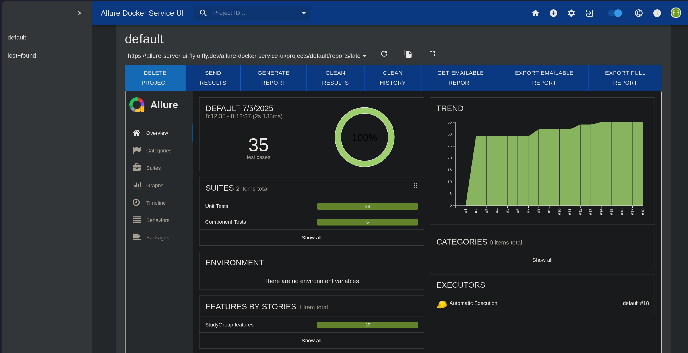

# Allure Server

```
SEEMS THAT THE UI DOES NOT WORK WITH BRAVE BROWSER, I USED FIREFOX AND ALL WAS OK 
```

I set up an allure server which stores all runs of the tests in the pipeline with its results



To access it:

1. Navigate to the provided url
2. Enter provided credentials
3. Click on side bar menu
4. Click on `default` 

## Tech Stack

For setting it up I used the containerized allure server that you can find here [fescobar/allure-docker-service](https://github.com/fescobar/allure-docker-service) and another container for the UI [fescobar/allure-docker-service-ui](https://github.com/fescobar/allure-docker-service-ui), all ran in fly.io servers